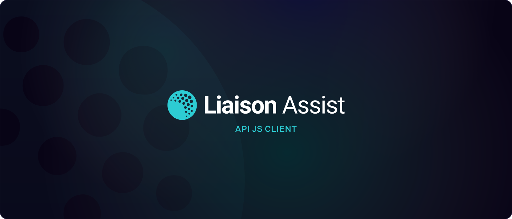

<p align="center">
  🏌️‍♂️ Liaison Assist API JS Client
  <br />
  Generated using <a href="https://github.com/openapistack/openapi-client-axios">openapi-client-axios</a> from the OpenAPI v3 definition
</p>

# Installation

Using your node runtime of choice install the package.

```sh
bun add @liaisongroup/assist-api-js-client -D
```

# Usage

Create a file such as `client.ts` to store an instance of our JS Client.

```ts
import { init } from "@liaisongroup/assist-api-js-client"

export const client = init("https://assist-dev-api.liaison.link")
// ^ returns a full typed client, with autocomplete for all methods, parameters etc.
```

Then when needed, just import this `client` in project files as needed.

`init` takes the API base URL as an optional argument, otherwise it will default to the value defined in the OpenAPI definition.

```ts
import { client } from "some/path/to/client"

async function make_api_call() {
  const sso_configs = await client.get_sso_configs()
}
```

# Working with a local OpenAPI definition

If you want to work with a local OpenAPI definition (ie. you have the `infinity-api` repo setup), then you can:

1. Clone this repo and install its dependencies
2. Setup an `.env.local` file, with the absolute path to the OpenAPI file (ie. `OPENAPI_URL="/path/to/infinity-api/openapi.yaml"`)
3. Run `bun dev` to start the development server. This will watch for changes to the OpenAPI file and regenerate the client as needed.
4. From the front-end repo, reference this local repo instead of installing from remote. For example:

```json
{
  "@liaisongroup/assist-api-js-client": "../assist-api-js-client"
}
```
